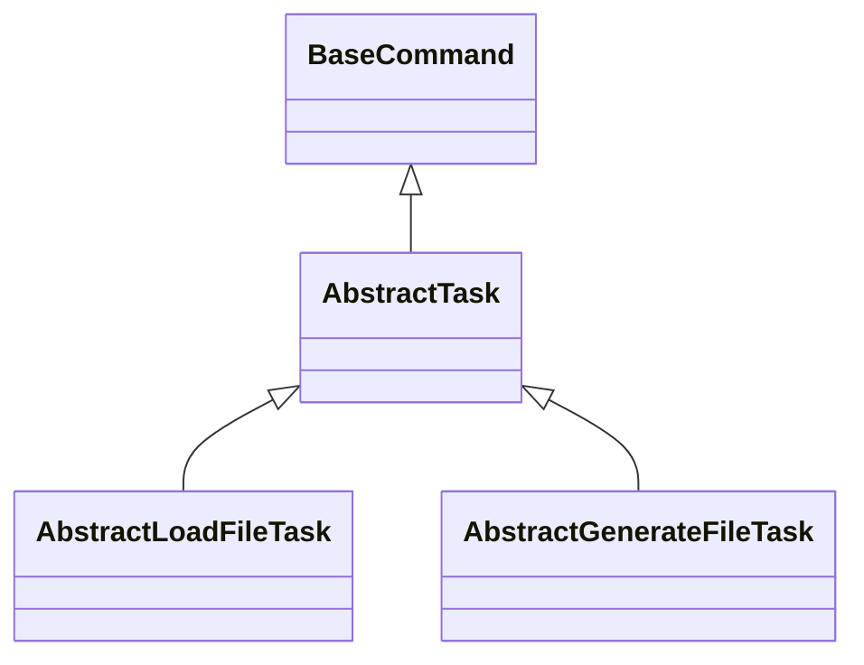
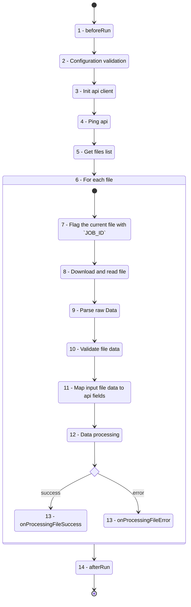
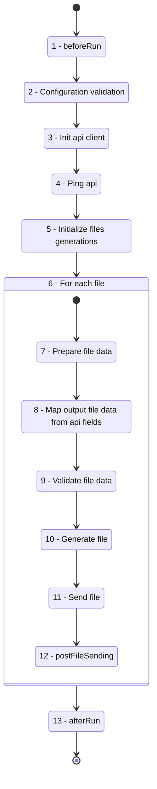

# User Guide

<!-- TABLE OF CONTENTS -->
<details id="top">
 <summary>Table of Contents</summary>
  <ol>
    <li>
      <a href="#introduction">Introduction</a>
      <ul>
        <li><a href="#built-with">Built With</a></li>
        <li><a href="#versioning-scheme">Versioning scheme</a></li>
      </ul>
    </li>
    <li>
      <a href="#fundamentals">Fundamentals</a>
      <ul>
        <li><a href="#flows">Flows</a></li>
        <li><a href="#spacefill-api-sdk">Spacefill API SDK</a></li>
        <li><a href="#transfer-utils">Transfert utils</a></li>
      </ul>
    </li>
    <li>
      <a href="#installation">Installation</a>
      <ul>
        <li><a href="#creating-a-new-project">Creating a new project</a></li>
        <li><a href="#lint">Lint</a></li>
        <li><a href="#testing">Testing</a></li>
        <li><a href="#build-js">Build JS</a></li>
        <li><a href="#build-docker-images">Build Docker images</a></li>
      </ul>
    </li>
  </ol>
</details>

## Introduction

The Spacefill's integration framework is an EDI integration framework.

It provides a structure and entry points for creating EDI connectors, making it possible to standardize the way connectors are built and thus facilitate the overall maintainability of all connectors.

<p  align="right" style="text-align:right;">(<a href="#top">back to top</a>)</p>

### Built with

The framework is built with [NodeJS](https://nodejs.org/en) `18.12` and [Typescript](https://www.typescriptlang.org/) `5.x`.

<p  align="right" style="text-align:right;">(<a href="#top">back to top</a>)</p>

### Versioning scheme

Spacefill's integration framework follows [Semantic Versioning](https://semver.org/).

When referencing the Spacefill's integration framework from your application or package, you should always use a version constraint such as `^1.0`, since major releases of Spacefill's integration framework do include breaking changes.

<p  align="right" style="text-align:right;">(<a href="#top">back to top</a>)</p>

## Fundamentals

The main concept of the framework is to standardize EDI flows. 2 types are currently available::

- [Load file flow](#load-file-flow)
- [Generate file flow](#generate-file-flow)

Each of these flows structure the way of process files in a EDI connector and extend from a base structure:

<div align="center">



</div>

- `BaseCommand` is the base class for all CLI commands, allowing to manage command arguments.

  - It's also providing common arguments like:
    - `--print-config`: To print current configuration.
    - `--print-statistics`: To print command statistics (duration, cpu & ram usages) at the end or the run.
    - `--debug`: To force the log level to `debug`.

- `AbstractTask` is base class for all EDI task commands. It defines the common elements needed in the EDI task flows like the initialization of the [Spacefill API SDK](#spacefill-api-sdk) and the [transfer utils](#transfer-utils) class.
  - The class defined a common argument to disable edi events: `--disable-events`.
    To know more about EDI events please check the [documentation](https://developer.spacefill.fr/reference/spacefill-api-event-logging).

<p  align="right" style="text-align:right;">(<a href="#top">back to top</a>)</p>

### Flows

#### Load file flow

<div align="center">



</div>

|  #  | Steps                                   | Descriptions                                                                                                                                                                                                                                                                                                     |
| :-: | :-------------------------------------- | :--------------------------------------------------------------------------------------------------------------------------------------------------------------------------------------------------------------------------------------------------------------------------------------------------------------- |
|  1  | **beforeRun**                           | `BaseCommand` uses this method to retrieve the metrics required for the `--print-statistics` option. It can be overloaded to implement actions triggered before the task start.                                                                                                                                  |
|  2  | **Configuration validation**            | Validate configuration. (Required configuration, values format, etc...)                                                                                                                                                                                                                                          |
|  3  | **Init api client**                     | Initializes the api wrapper with the configuration.                                                                                                                                                                                                                                                              |
|  4  | **Ping api**                            | Ping the Spacefill api to check everything is alright before start processing files.                                                                                                                                                                                                                             |
|  5  | **Get files list**                      | Retrieves the files list to be consumed.                                                                                                                                                                                                                                                                         |
|  6  | **For each file**                       | For each file perform a list of actions. If an exception is triggered during the processing of one file, an error event will be triggered and the next file will be processed.                                                                                                                                   |
|  7  | **Flag the current file with `JOB_ID`** | Renames the current file with the Windmill `JOB_ID`.<br /> e.g: `TARGET_FILE.txt` -> `TARGET_FILE.txt.018c4913-b14c-5b67-45b1-b9dc7c01d553`<br /> This step adds security to prevent a file from being processed several times, and allows you to indicate which file has been managed by which job in Windmill. |
|  8  | **Download and read file**              | Downloads the file locally in a temporary directory, and load the content.<br />File content shouldn't be load directly from remote server, to prevent issues from unstable sftp/ftp servers.                                                                                                                    |
|  9  | **Parse raw Data**                      | Converts raw string data into a basic column->value object.                                                                                                                                                                                                                                                      |
| 10  |  **Validate file data**                 | Validates the mapped data against the file specifications, to ensure that the loaded file can be consumed by the Spacefill API.                                                                                                                                                                                  |
|     |

| 11 | **Map input file data to api fields** | Map basic column-value object to the api fields. |

| 12 | **Data processing** | Process mapped data (call the api, etc...). |
| 13 | **onProcessingFileSuccess** | This method is triggered when a file has been successfully processed. <br />It can be used to move the file to the archive directory or for other clean-up actions. |
| | **onProcessingFileError** | In case of error during file processing, this method is triggered. <br />It can be use to move file to error directory or for other clean-up actions. |
| 14 | **afterRun** | `BaseCommand` uses this method to compute the metrics required for the `--print-statistics`. It can be overloaded to implement actions triggered after the task is completed. |

<p  align="right" style="text-align:right;">(<a href="#top">back to top</a>)</p>

#### Generate file flow

<div align="center">



</div>

|  #  | Steps                                    | Descriptions                                                                                                                                                                                   |
| :-: | :--------------------------------------- | :--------------------------------------------------------------------------------------------------------------------------------------------------------------------------------------------- |
|  1  | **beforeRun**                            | `BaseCommand` uses this method to retrieve the metrics required for the `--print-statistics` option. It can be overloaded to implement actions triggered before the task start.                |
|  2  | **Configuration validation**             | Validates configuration. (Required configuration, values format, etc...)                                                                                                                       |
|  3  | **Init api client**                      | Initializes the api wrapper with the configuration.                                                                                                                                            |
|  4  | **Ping api**                             | Ping the Spacefill api to check everything is alright before start processing files.                                                                                                           |
|  5  | **Initialize files generations**         | Defines the number of files to be generated and the associated configuration.                                                                                                                  |
|  6  | **For each file**                        | For each file to be generated perform a list of actions. If an exception is triggered during the processing of one file, an error event will be triggered and the next file will be processed. |
|  7  | **Prepare file data**                    | Retrieves data from Spacefill API.                                                                                                                                                             |
|  8  | **Map output file data from api fields** | Maps the api data to the target file columns, to be ready to use in file generation.                                                                                                           |
|  9  |  **Validate file data**                  | Validates the mapped data against the target file specifications, to ensure that the generated file can be consumed by the WMS/ERP.                                                            |
| 10  | **Generate file**                        | Generates the file locally.                                                                                                                                                                    |
| 11  | **Send file**                            | Sends the generated file to the SFTP/FTP server.                                                                                                                                               |
| 12  | **postFileSending**                      | Free method for implementing actions after a file has been sent to the WMS.<br />Can be used to update `transfered_to_wms_at` for example.                                                     |
| 13  | **afterRun**                             | `BaseCommand` uses this method to compute the metrics required for the `--print-statistics`. It can be overloaded to implement actions triggered after the task is completed.                  |

</div>

<p  align="right" style="text-align:right;">(<a href="#top">back to top</a>)</p>

## Spacefill API SDK

All classes inheriting from `AbstractTask` will benefit from an `sdk` attribute. This sdk allows you to use the Spacefill API.

It's composed of:

- A **Spacefill API Client** built with [`openapi-client-axios`](https://openapistack.co/docs/openapi-client-axios/intro/), that also to generate axios client from the openapi file definition ([openapi.json](https://api.spacefill.fr/openapi.json)).

  - To request the api, simply use the associated method to the target endpoint:
    - e.g: `await this.sdk.client.get_v1_ping()`
  - All routes and methods are automatically typed in the client, so you can easily use autocompletion from your IDE.

- An **EdiEvent** class managing the events sending to the API. To know more about EDI events, please check the [documentation](https://developer.spacefill.fr/reference/spacefill-api-event-logging).

  - Example of event sending:

  ```javascript
  await this.sdk.ediEvent.send(
    EventTypeEnumString.SUCCESS,
    `File generation ended. Type=${this.getWorkflowType()}`,
  );
  ```

  - :blue_book: Notice that the framework implements some custom exceptions. Each time one of these exceptions is triggered, an event is automatically sent to the API. It is therefore not necessary to send an event for errors.
    - [`ApiNetWorkError`](../src/exceptions/ApiNetWorkError.ts)
    - [`InternalError`](../src/exceptions/InternalError.ts)
    - [`InvalidRequestDataError`](../src/exceptions/InvalidRequestDataError.ts)
    - [`InvalidRequestFormatError`](../src/exceptions/InvalidRequestFormatError.ts)
    - [`IoError`](../src/exceptions/IoError.ts)
    - [`NetWorkError`](../src/exceptions/NetWorkError.ts)
    - [`PreconditionFailedError`](../src//exceptions/PreconditionFailedError.ts)
    - [`UnknownError`](../src/exceptions/UnknownError.ts)

- The attribute `dataSource` is used to fill [Spacefill API HTTP headers](https://developer.spacefill.fr/reference/spacefill-api-event-logging#headers-list) with the data source (the file consumed or the file to be generated) to indicate the context in which a call is made to the API.

  - Other HTTP headers can be Initialized in the entry point only once. Example with the Logis connector:

    ```javascript
    // ./src/TaskLauncher.mts
    try {
      const currentFilePath = fileURLToPath(import.meta.url);
      const integrationFrameworkPkgInfo = await readPackage({
        cwd: path.resolve(currentFilePath, "../../node_modules/@spacefill/integration-framework"),
      });
      process.env.SPACEFILL_API_CONTEXT_SERVICE_VERSION = integrationFrameworkPkgInfo.version;
    } catch (exception) {
      Console.warn("Cannot retrieve @spacefill/integration-framework version");
      Console.debug(exception);
    }

    process.env.SPACEFILL_API_CONTEXT_SERVICE_SOURCE = "LOGIS";
    process.env.SPACEFILL_API_CONTEXT_TRANSPORT = "EDI";
    process.env.SPACEFILL_API_CONTEXT_CLIENT_TYPE = "WMS";
    ```

- The `upload()` method is a separated method from the client, to manage upload calls. It allows to manage specific HTTP headers and body for it.

<p  align="right" style="text-align:right;">(<a href="#top">back to top</a>)</p>

## Transfer utils

All classes inheriting from `AbstractTask` will benefit from an `transfer` attribute, enabling them to manage files download/uploading from local/sftp/ftp.

It includes a retry system in the event of an error. By default, there are 3 attempts, with a 5-second pause between each attempt.

<p  align="right" style="text-align:right;">(<a href="#top">back to top</a>)</p>

## Installation

### Creating a new project

- Initialize the repository from the [edi-connector-template](https://github.com/spacefill/edi-connector-template):

  _(Replace `my-new-connector` with the name of your connector repository.)_

  ```sh
  git clone --depth=1 git@github.com:spacefill/edi-connector-template.git -b main my-new-connector
  ```

- Init Git

  ```sh
  cd my-new-connector
  rm -rf .git
  git init
  git remote add origin git@github.com:spacefill/my-new-connector.git
  git add .
  git commit -m "Init repository"
  git push
  ```

- The repository is using [asdf](https://asdf-vm.com/) to manage the runtime versions.

  Install nodejs with `asdf install`.

- Init the .npm_auth file:

  ```sh
  cp .npm_auth.example .npm_auth
  ```

- Edit `.npm_auth` with the `AUTH_TOKEN` provided by Spacefill. Spacefill should send to you the `AUTH_TOKEN` at the beginning of the development, if it's not the case please ask for it.

- Export the token. You'll need to do this at least once in your shell if you want to use `yarn` commands.

  ```sh
  export $(cat .npm_auth | xargs)
  ```

- Install libraries

  ```sh
  yarn install
  ```

- Edit `./scripts/docker-image.sh` to update the Docker image target used for the builds.

- Edit the `README.md` file to update the title, to remove the template warning and specify the target WMS/ERP.

- Use `./doc` directory to put the WMS/ERP documentation.

- Run tests to check everything is ok

  ```sh
    yarn run tests
  ```

<p  align="right" style="text-align:right;">(<a href="#top">back to top</a>)</p>

### Lint

Lint is managed with [Eslint](https://eslint.org/). Check `.eslintrc.js` file to see/edit the configuration.

```sh
yarn run lint
```

<p  align="right" style="text-align:right;">(<a href="#top">back to top</a>)</p>

### Testing

Tests are implemented with [Mocha](https://mochajs.org/) and [Chai](https://www.chaijs.com/).

Several commands are available:

- Run all tests

  ```sh
  yarn run tests
  ```

- Run all tests with coverage report.

  ```sh
  yarn run tests:coverage
  ```

- Run one or more tests based on a target directory or file

  ```sh
  # run all tests in tests/ci/load_order_acknowledge/
  yarn run test tests/ci/load_order_acknowledge/

  # run tests in tests/ci/load_order_acknowledge/DefaultLoadOrderAcknowledge.test.ts
  yarn run test tests/ci/load_order_acknowledge/DefaultLoadOrderAcknowledge.test.ts
  ```

- Run one or more tests based on a pattern

  ```sh
  # run all "it" tests that include "getWorkflowType pattern
  yarn run tests -g getWorkflowType
  ```

<p  align="right" style="text-align:right;">(<a href="#top">back to top</a>)</p>

### Build JS

Building is using `src/TaskLauncher.mts` as entry point.

- To make a js build, run:

  ```sh
  yarn run build
  ```

  The build will generate a `./dist/TaskLauncher.js` file, you can use directly:

  ```sh
  $ ./TaskLauncher.js -h

  Options:
    -h, --help                              Console this help and exit.
    --debug                                 Force log level to DEBUG.
    -e, --env                               Path to environment variables file. e.g: --env=.env
    --wms-default-dir                       Root dir for transfer. e.g: --wms-default-dir=/root-dir => /root-dir/archives
    --print-config                          Display the environment variables values and exit.
    --print-statistics                      Display the resource usage at the end of the process
    -t, --task                              Task name to run.
    -m, --mode                              Mode used to run the task. By default, mode=default.
  ```

<p  align="right" style="text-align:right;">(<a href="#top">back to top</a>)</p>

### Build Docker images

To run the connector in production in Windmill, you'll need to build a Docker image.

Scripts are presents in ̀`./scripts` directory to build and push Docker image for sandbox and production.

:warning: Before start building a Docker image, please be sure to have edit the target image in `./scripts/docker-image.sh` and to use **`amd64`** architecture. If you have any doubts please contact Spacefill.

- To make a build simply run the associated script:

  ```sh
  # sandbox
  ./scripts/build-docker-image-sandbox.sh
  # prod
  ./scripts/build-docker-image-prod.sh
  ```

  ℹ Please notice that the build scripts are dropping `dist` directory and rebuilding automatically the project.

- Push the image to DockerHub with:

  ```sh
  # sandbox
  ./scripts/push-docker-image-sandbox.sh
  # prod
  ./scripts/push-docker-image-prod.sh
  ```

<p  align="right" style="text-align:right;">(<a href="#top">back to top</a>)</p>
